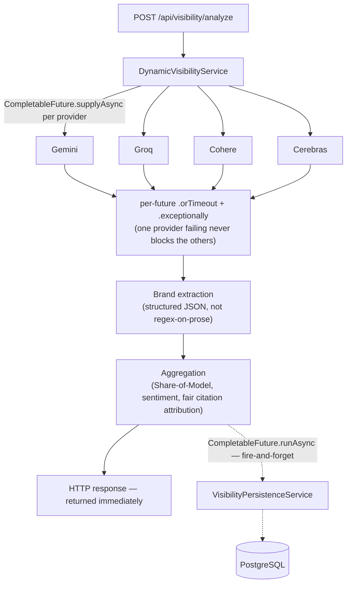

# AI Visibility Tracker — Backend

A Spring Boot service that measures **brand visibility inside AI-generated answers**. It sends a free-form prompt (optionally with specific brands to track) to multiple LLM providers concurrently, extracts which brands each model actually mentioned, computes Share-of-Model and citation metrics, and persists the results — all without blocking the caller on the slowest provider or on the database write.

---

## Overview

Ask an LLM *"what are the best CRM tools for a startup?"* and only a handful of brands ever get named. This service turns that into a measurable, comparable signal:

1. Query N AI providers **in parallel** with the same (augmented) prompt.
2. Ask each model to self-report, in structured JSON, which brands it mentioned — rather than guessing from free-form prose.
3. Aggregate per-brand mention counts, Share-of-Model, sentiment, and citation sources across all providers.
4. Return the result to the caller immediately; persist it to Postgres in the background.

---

## Architecture



The response path and the persistence path are deliberately decoupled: the user gets their answer as soon as the LLM calls and aggregation finish, and the database write happens afterward on a separate thread pool, with failures logged rather than silently swallowed or allowed to block the response.

---

## Tech Stack

| Layer | Choice |
|---|---|
| Language / Runtime | Java 17 |
| Framework | Spring Boot 3.2 |
| Database | PostgreSQL, via Spring Data JPA / Hibernate |
| Connection pooling | HikariCP |
| HTTP client | OkHttp (used uniformly across all provider integrations) |
| JSON | Gson (provider request/response parsing) + Jackson (internal DTO parsing) |
| Boilerplate reduction | Lombok |
| Concurrency | `CompletableFuture` scatter-gather over a dedicated bounded thread pool |

**AI providers integrated:**

| Provider | Model(s) | Web search / grounding |
|---|---|---|
| Google Gemini | `gemini-2.5-flash` | Native "Grounding with Google Search" — returns the actual pages it searched |
| Groq | `groq/compound`, `groq/compound-mini` (fallback: `llama-3.3-70b-versatile`, `qwen/qwen3-32b`, `llama-3.1-8b-instant`) | `compound`/`compound-mini` run Groq's own agentic system with built-in search; plain models have none |
| Cohere | `command-a-plus-05-2026` | Multi-turn tool-calling loop against **Tavily** search, implemented in-house (no native web search on Cohere's plain chat API) |
| Cerebras | configurable (`gpt-oss-120b` by default) | None — plain chat completions |

---

## Design Decisions & Trade-offs

A few of these are the kind of thing worth being able to explain out loud, not just point at:

**Why `CompletableFuture` scatter-gather instead of a loop?**
Sequential calls to 4 providers at ~2-15s each would mean a 30-60s response. Each provider's call is wrapped in `supplyAsync(...).orTimeout(45s).exceptionally(...)`, so `CompletableFuture.allOf(...).join()` is guaranteed to never throw — every future resolves to either a real result or a typed failure. One slow/failing provider (in practice, this happens routinely — see Known Limitations) never blocks or corrupts the others.

**Why is persistence async and separate from the response?**
The HTTP response must never wait on a database round-trip. `VisibilityPersistenceService.saveCustomAnalysis(...)` runs via `CompletableFuture.runAsync(...)` *after* the response is already built, with `.exceptionally(...)` logging any DB failure instead of losing it silently. Equally important: no `@Transactional` method ever wraps a network call — the LLM calls complete fully before the transactional persistence method is invoked, so a slow provider can never hold open a database connection.

**Why structured JSON extraction instead of parsing prose?**
An earlier version of this extraction logic tried to regex-match bolded markdown text out of the model's free-form answer to guess at brand names — it reliably produced false positives (generic phrases like "Great Choice" or "24/7 Support" got misclassified as brands). The current approach instead asks the model to append a strict, schema-defined JSON block evaluating either the caller's exact target-brand list or (in open-ended mode) a self-reported list of real brand names — with an allow-list check against the caller-supplied brands as a second line of defense. See `DynamicVisibilityService.buildAugmentedPrompt` / `extractBrandEvaluations`.

**Why does `GroqService`/`CohereService` not follow the same class shape as `GeminiService`/`CerebrasService`?**
`AbstractAIService` is a Template Method base for providers that are a single request/response round-trip (Gemini, Cerebras). Groq needs a multi-model fallback loop (some free-tier models get decommissioned without notice, and `groq/compound` can fail with a payload-size error that has nothing to do with the plain chat models below it) and Cohere needs a bounded multi-turn tool-calling loop (ask → maybe search via Tavily → feed results back → repeat). Forcing either into a single-request template would need awkward escape hatches, so both implement `AIService` directly instead — while still reusing shared helpers (`OpenAiCompatibleChatClient`, `CitationTextExtractor`) rather than duplicating protocol-level code.

**Why is citation counting "fair-share" rather than a flat sum?**
A model's response doesn't tell you which specific citation belongs to which specific brand — that link isn't in the data. Attributing every citation in a response to every brand that response mentioned would inflate totals (5 brands × 5 citations = "25 citation credits", not 5). Citations are instead split evenly across the brands a given response mentioned, and citations across providers are round-robin interleaved (not appended provider-by-provider) before ranking, so a provider that happens to return more raw citations can't crowd out every other provider's sources once the UI shows a top-N list.

**Why does `PromptRepository` use `JOIN FETCH`?**
`findByCategoryWithMentions` fetches `Prompt` → `Mention` → `Brand` in one query to avoid N+1 lazy-loading in a loop — the classic JPA footgun for anything that renders a list of parent entities alongside a child collection.

---

## API

| Method | Path | Body | Description |
|---|---|---|---|
| `POST` | `/api/visibility/analyze` | `{ "userPrompt": string, "targetBrands": string[], "aiModels": string[] }` | Runs the scatter-gather analysis and returns aggregated metrics immediately |
| `GET` | `/api/brands` | — | All tracked brands |
| `GET` | `/api/brands/category/{categoryName}` | — | Brands scoped to a category |
| `GET` | `/api/categories` | — | All category names |

`targetBrands` is optional — if provided, the model evaluates exactly those brands *and* separately reports any other competitor brands it mentioned (so tracking one brand still surfaces its competitors); if omitted, brand discovery is fully open-ended.

---

## Database Schema

| Table | Purpose |
|---|---|
| `prompts` | One row per (prompt, model) pair — the raw query and full response text |
| `brands` | Distinct brand names seen, scoped to a category |
| `mentions` | A brand being mentioned in a specific prompt/model response, with position/sentiment/context |
| `citations` | Source URLs extracted per mention (native grounding where a provider supports it, regex-extracted otherwise) |
| `categories` | Currently a single always-present placeholder row (`customSearch`) — see note below |

**Note on `categories`:** the schema keeps a `Category` FK on `Prompt`/`Brand` because it's forward-compatible scaffolding for a planned historical/trend dashboard (grouping many prompts under a tracked topic over time — see roadmap below), not because the current single-prompt flow does any real categorization today. Worth being upfront about this if asked, rather than implying it's doing more than it is.

---

## Setup

### Prerequisites
- Java 17+
- Maven 3.8+
- PostgreSQL 13+
- API keys for whichever providers you want active (a provider with no key configured is simply skipped, not treated as an error)

### Database
```sql
CREATE DATABASE ai_visibility_tracker;
```
Schema is managed via Hibernate `ddl-auto=update` — tables are created/updated automatically on startup. No manual seed data is required.

### Configuration

Real secrets are **never** committed — `application.properties` reads every key via `${ENV_VAR:}` placeholders with no default. For local development, create `src/main/resources/application-local.properties` (already covered by `.gitignore`) with your actual values:

```properties
GOOGLE_API_KEY=...
GROQ_API_KEY=...
CEREBRAS_API_KEY=...
COHERE_API_KEY=...
TAVILY_API_KEY=...
DB_USERNAME=...
DB_PASSWORD=...
```

Then run with the `local` profile active:

```bash
export SPRING_PROFILES_ACTIVE=local   # or set in your IDE run configuration
```

### Running

```bash
mvn clean install
mvn spring-boot:run
```

Starts on `http://localhost:8081`.

### Frontend

Maintained as a separate React app, pointed at this backend via `VITE_API_URL` (defaults to `http://localhost:8081/api`).

---

## Known Limitations

Being upfront about these is more useful than hiding them:

- **No automated test suite yet.** Everything here has been validated through manual end-to-end runs against live provider APIs, not unit/integration tests.
- **No DB migration tool.** `ddl-auto=update` means schema drift (e.g. a stale `CHECK` constraint after adding a new enum value) has to be caught and fixed manually rather than via a tracked migration.
- **Cohere's tool-calling wire format was reverse-engineered against live behavior**, not a stable published contract for this exact flow — a Cohere-side change could require adjusting `CohereService`'s parsing.
- **Provider availability is a real dependency.** Any provider can be unavailable for reasons outside this code (billing/quota, rate limits, model deprecation) — the scatter-gather design ensures the rest of the system keeps working when that happens, but it's not something this service controls.

## Roadmap

Deliberately scoped out of the current version:
- Semantic prompt caching (vector similarity search to avoid re-querying LLMs for near-duplicate prompts)
- Historical/category dashboard (trend tracking across many prompts over time, as opposed to today's single-prompt analysis)

---

## Author

Pranchal Gupta
